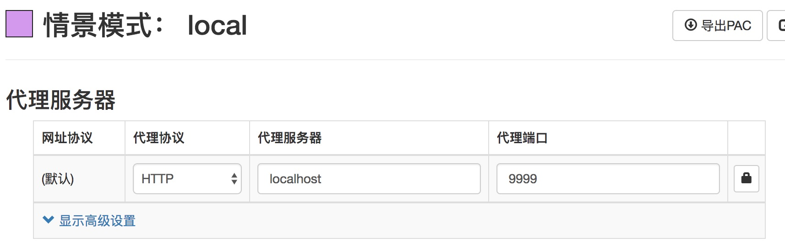
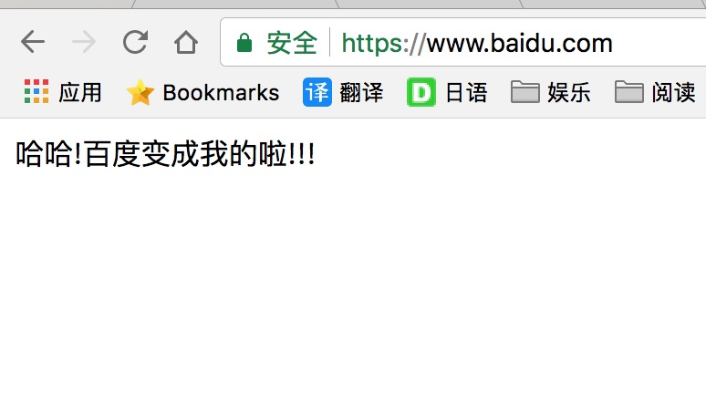

# noginx 

**a http/https proxy for nodejs**

## Feature

1. http/https proxy
2. middleware use express

## Demo

``` javascript
const noginx = require("noginx");
const app = noginx.express();

app.use(function(req, res, next) {
    if (req.headers["host"] == "www.baidu.com") {
        res.writeHead(200, { "content-type": "text/html;charset=utf8" });
        res.write("哈哈!百度变成我的啦!!!");
        res.end();
    } else {
        next();
    }
});

app.listen(9999);
```

proxy setting (such as `SwitchyOmega`)


visit <https://www.baidu.com>
